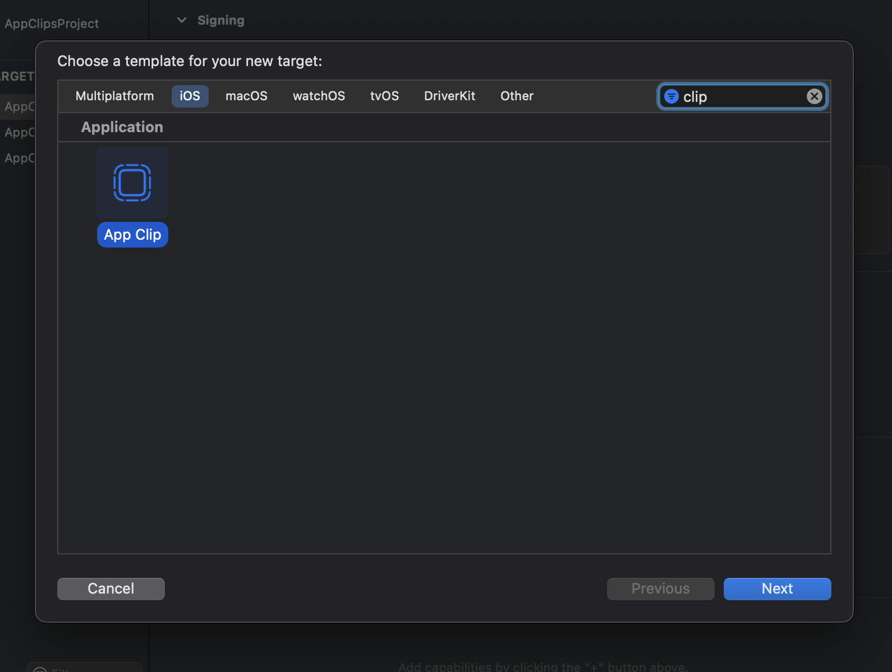
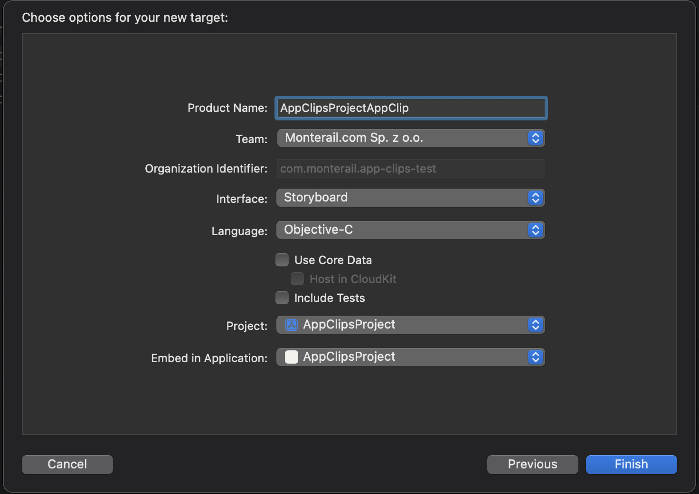
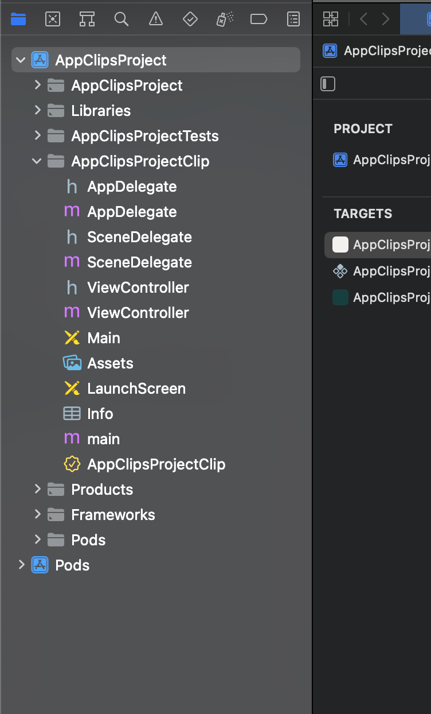
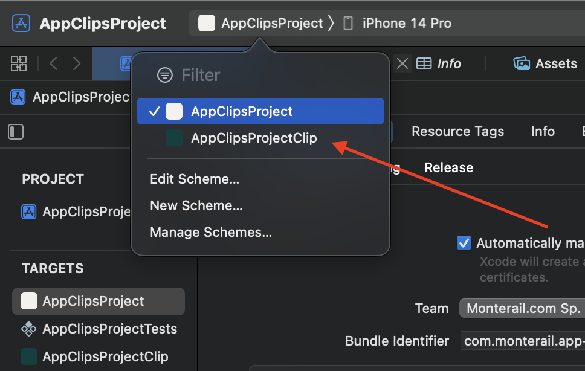
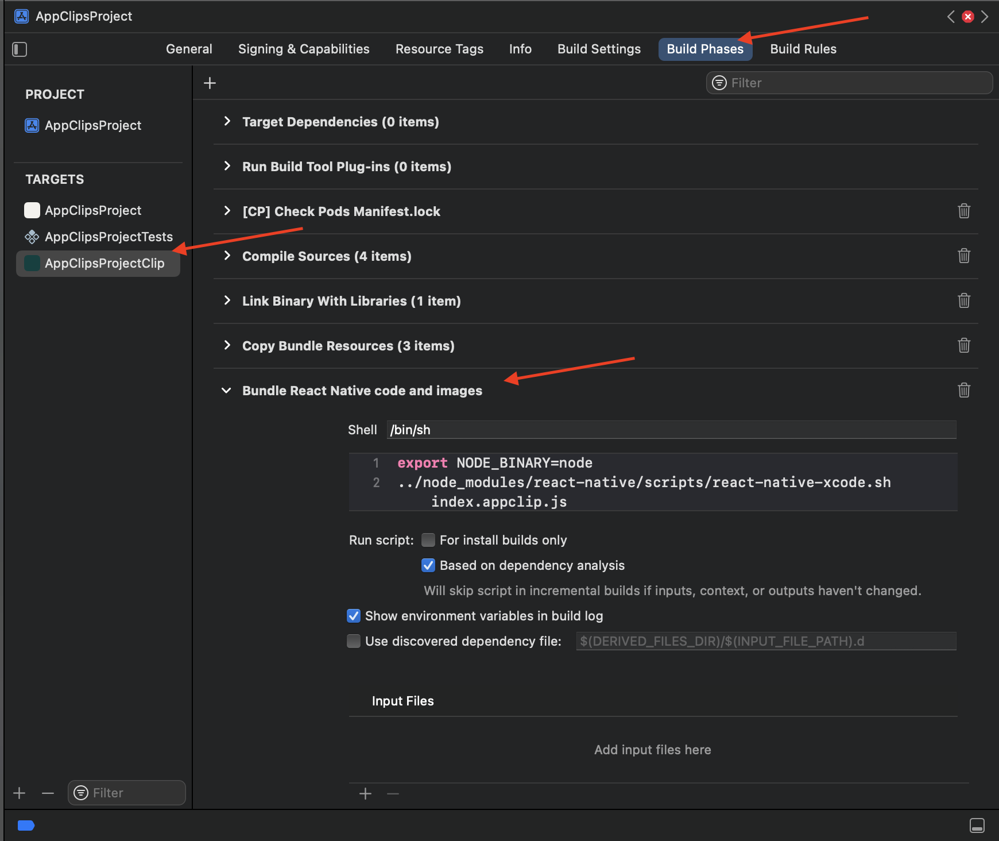

# How to create app clips in react native?

1. Create new react native project
2. Open project in xcode. Then go to File -> New -> Target and search for app clips
   
3. Use this selections to create new app clip
   
4. You should see created app clip inside your project
   
5. Add required pods for your app clip - open ios/Podfile and add there following code

   ```
   target '<your app name>' do
    inherit! :complete
    # Pods for testing
   end

    # add to create app clips
   target '<your app clip name>' do
    inherit! :complete
    # Pods for testing
   end
   ```

6. Run `pod install`
7. You need to modify `ios/<your app clip name>/AppDelegate.m` file to add RTCRootView, which is used by React Native to app clip project. This is how your AppDelegate.m file should look like.

```
#import "ViewController.h"
#import <React/RCTBundleURLProvider.h>
#import <React/RCTRootView.h>

@interface ViewController ()

@end

@implementation ViewController

 (void)loadView {

  NSURL *jsCodeLocation = [[RCTBundleURLProvider sharedSettings] jsBundleURLForBundleRoot:@"index.appclip"];

  RCTRootView *rootView = [[RCTRootView alloc] initWithBundleURL:jsCodeLocation
                                                      moduleName:@"AppClipsProject"
                                               initialProperties:nil
                                                   launchOptions:nil];
  rootView.backgroundColor = [[UIColor alloc] initWithRed:1.0f green:1.0f blue:1.0f alpha:1];

  self.view = rootView;

}

(void)viewDidLoad {
    [super viewDidLoad];
    // Do any additional setup after loading the view.
}

@end
```

8. As you can see app clips has different bundle root and module name, so to handle it in js code in react native, you need to create index in the root of the project for app clips - in this case create `index.appclip.js` file. This file should look like below

```
import {AppRegistry} from 'react-native';
import React from 'react';

const AppClip = () => (
  <View style={{flex: 1, justifyContent: 'center', alignItems: 'center'}}>
   {/* content of your app clips in react native */}
  </View>
);

AppRegistry.registerComponent('AppClipsProjectClip', () => AppClip);
```

9. Add keys needed to start the app clip to `ios/<your app clip name>/Info.plist`
   ```
   <key>NSAppTransportSecurity</key>
   <dict>
   	<key>NSAllowsArbitraryLoads</key>
   	<true/>
   	<key>NSExceptionDomains</key>
   	<dict>
   		<key>localhost</key>
   		<dict>
   			<key>NSExceptionAllowsInsecureHTTPLoads</key>
   			<true/>
   		</dict>
   	</dict>
   </dict>
   ```
10. Try to build and run app clip using xcode
    
    Note: If you're using react native > 0.69.6 it's likely that you'll get an error similar to `[AppDelegate window]: unrecognized selector sent to instance 0x600000dbc060`. To fix it change code of `ios/<your app clip name>/AppDelegate.h` to

```
#import <React/RCTBridgeDelegate.h>
#import <UIKit/UIKit.h>

 @interface AppDelegate : UIResponder <UIApplicationDelegate, RCTBridgeDelegate>

 @property (nonatomic, strong) UIWindow \*window;

 @end
```

11. For the release mode you should create run script for app clip - you can name it as below `Bundle React Native code and images` and place it below `Copy Bundle Resources`
    

```
export NODE_BINARY=node
../node_modules/react-native/scripts/react-native-xcode.sh index.appclip.js
```
