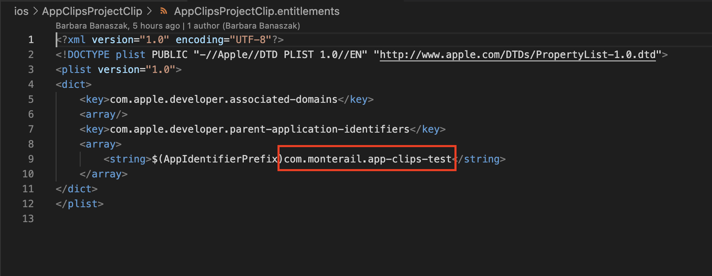

# Build release version of the app

To build release version of application containing app clip you need to be aware of several things.

1. Supported destinations for app and app clip targets have to be the same.
2. Version and build number for app and app clip have to be the same.
3. App clip bundle identifier should be parent (application) bundle identifier with suffix e.g

   - Parent Bundle Indetifier: com.test.app-clip-test
   - App Clip Bundle Identifier: com.test.app-clip-test.clip

   Both bundle identifiers need to be setup on App Store Connect.

4. Make sure that in `ios/<your app clip name>/<your app clip name>.entitlements` file key `com.apple.developer.parent-application-identifiers` is set to budle identifier of your app.
   
5. Remember to set icon for your app clip.
